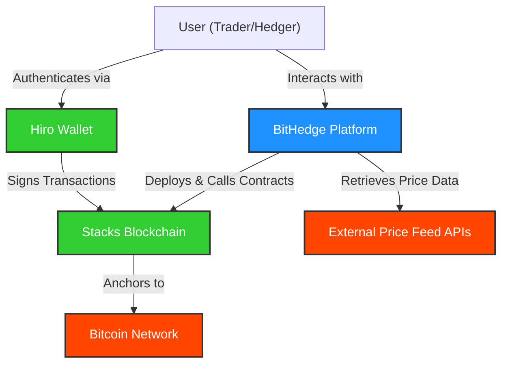
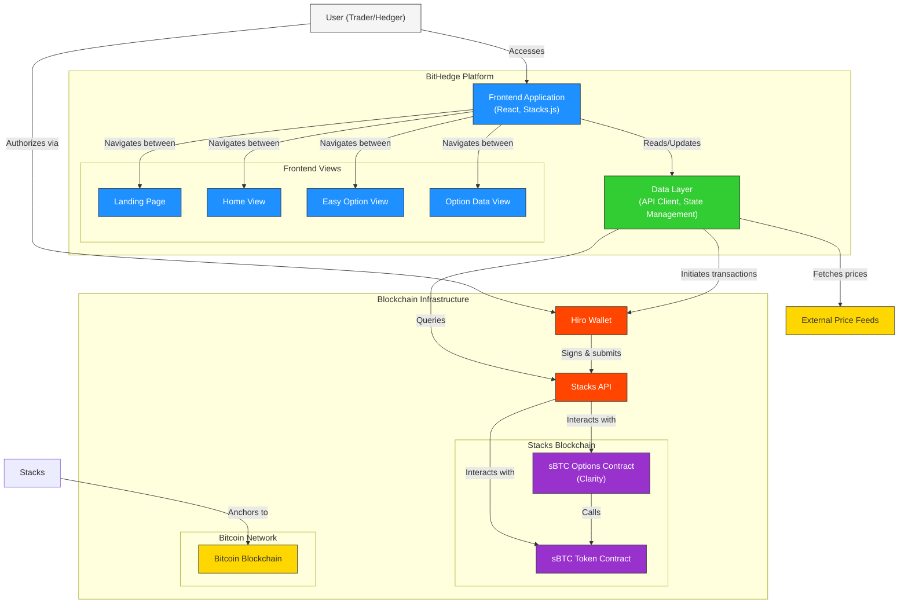
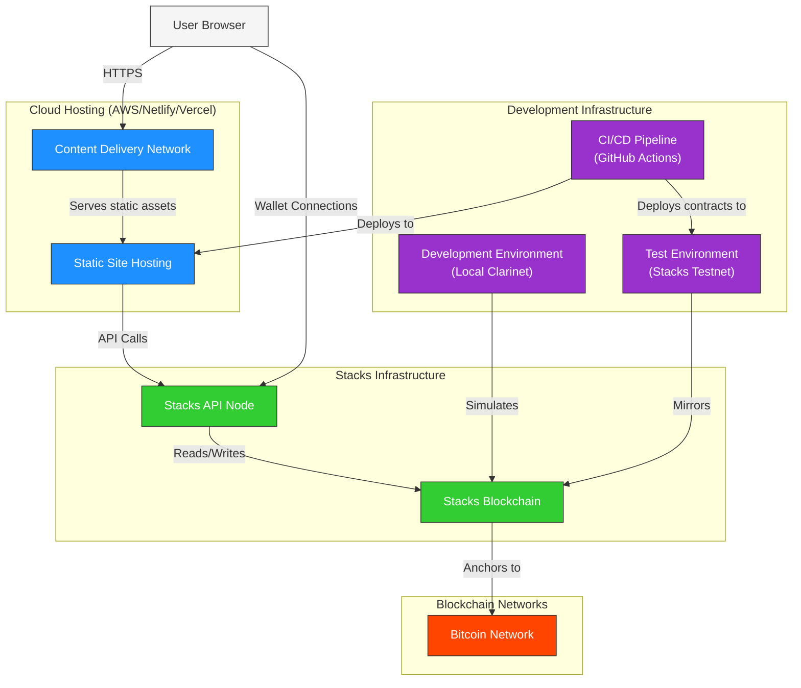
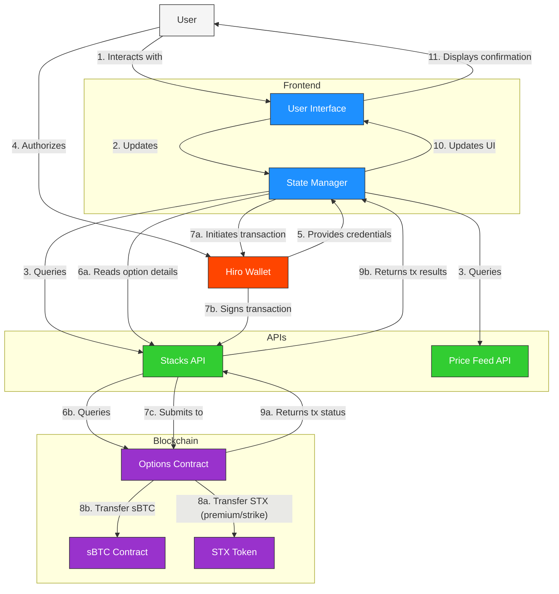
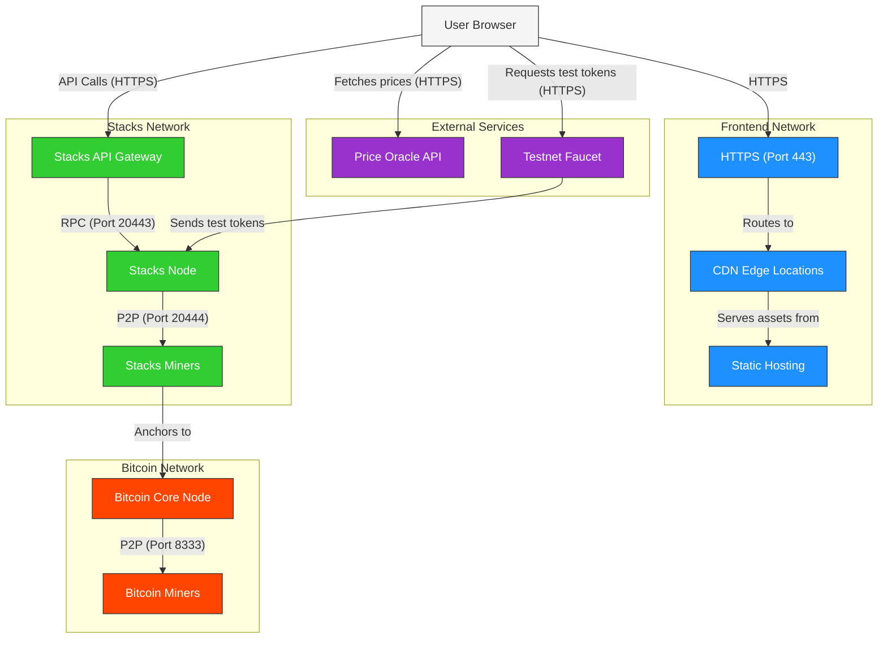
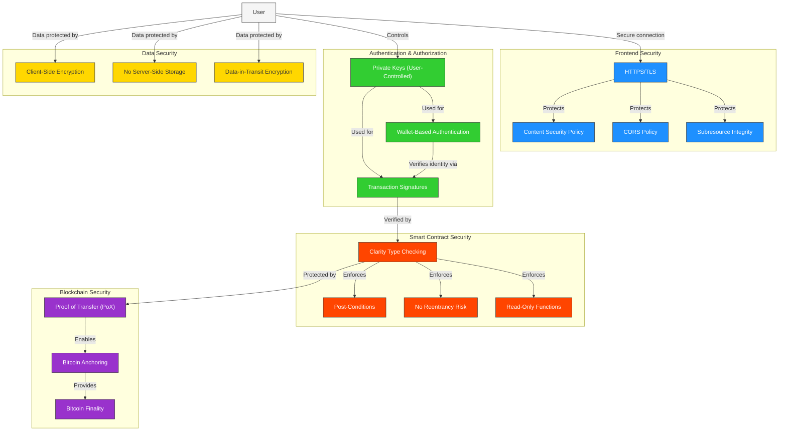

# BitHedge: System Architecture Diagrams

## Introduction

This document provides a comprehensive set of architecture diagrams for BitHedge, a decentralized options trading platform built on the Stacks blockchain. These diagrams illustrate the various layers, components, and interactions within the system to provide a clear understanding of the overall architecture.

## Context

- **Project Name**: BitHedge
- **System Type**: Web-based dApp (Decentralized Application)
- **Scale**: Initial MVP targeted for hackathon with potential to scale to thousands of users
- **Infrastructure**: Cloud-hosted frontend with Stacks blockchain backend
- **Key Requirements**:
  - Enable users to create and trade sBTC call options
  - Provide intuitive UI for both beginner and advanced users
  - Ensure secure handling of sBTC and STX transactions
  - Facilitate market overview and analytics
  - Support Bitcoin finality through Stacks blockchain

## 1. System Context Diagram



**Description**:

The System Context Diagram illustrates BitHedge's position within the broader ecosystem. Users interact with the BitHedge platform using Hiro Wallet for authentication and transaction signing. BitHedge communicates with the Stacks blockchain to deploy and call smart contracts while retrieving market data from external price feed APIs. The Stacks blockchain anchors to the Bitcoin network to leverage Bitcoin's security and finality.

## 2. Container Diagram



**Description**:

The Container Diagram breaks down the BitHedge platform into its main components. The frontend application consists of multiple views (Landing Page, Home View, Easy Option View, and Option Data View) built with React and Stacks.js. The Data Layer handles API interactions, state management, and transaction initiation. On the blockchain side, we have the Hiro Wallet for authentication, the Stacks API for blockchain interaction, and smart contracts (sBTC Options Contract and sBTC Token Contract) deployed on the Stacks blockchain, which anchors to Bitcoin for security.

## 3. Component Diagram

```mermaid
graph TB
    subgraph "Frontend Application"
        Router["Router<br/>(React Router)"]

        subgraph "Core Components"
            NavHeader["Navigation Header"]
            WalletConnector["Wallet Connector"]
            NotificationSystem["Notification System"]
            SharedUI["Shared UI Components"]
        end

        subgraph "View-Specific Components"
            LandingComponents["Landing Page Components"]
            HomeComponents["Home View Components"]
            EasyOptionComponents["Easy Option View Components"]
            DataViewComponents["Option Data View Components"]
        end

        subgraph "Data Visualization"
            PnLVisualizer["P&L Visualizer"]
            MarketCharts["Market Charts"]
            OptionsChain["Options Chain Matrix"]
            HeatMap["Heat Map Visualizer"]
        end

        subgraph "State Management"
            AppState["Application State"]
            WalletState["Wallet State"]
            ContractState["Contract State"]
            MarketDataState["Market Data State"]
        end
    end

    subgraph "Data Services"
        StacksService["Stacks Service"]
        MarketDataService["Market Data Service"]
        ContractService["Contract Service"]
        WalletService["Wallet Service"]
    end

    subgraph "Smart Contracts"
        OptionFunctions["Option Contract Functions"]
        OptionData["Option Data Structure"]
        SBTCInterface["sBTC Interface"]
    end

    Router -- "Routes to" --> LandingComponents & HomeComponents & EasyOptionComponents & DataViewComponents
    NavHeader & WalletConnector & NotificationSystem -- "Used by" --> Router

    LandingComponents & HomeComponents & EasyOptionComponents & DataViewComponents -- "Use" --> SharedUI
    HomeComponents -- "Uses" --> PnLVisualizer
    DataViewComponents -- "Uses" --> MarketCharts & OptionsChain & HeatMap
    EasyOptionComponents -- "Uses" --> PnLVisualizer

    AppState -- "Contains" --> WalletState & ContractState & MarketDataState
    HomeComponents & EasyOptionComponents & DataViewComponents -- "Read/Update" --> AppState

    WalletConnector -- "Uses" --> WalletService
    HomeComponents & EasyOptionComponents -- "Use" --> ContractService
    DataViewComponents -- "Uses" --> MarketDataService

    WalletService & ContractService -- "Use" --> StacksService
    ContractService -- "Calls" --> OptionFunctions
    OptionFunctions -- "Manages" --> OptionData
    OptionFunctions -- "Interacts with" --> SBTCInterface

    classDef routing fill:#1E90FF,stroke:#333,stroke-width:1px,color:white;
    classDef components fill:#32CD32,stroke:#333,stroke-width:1px,color:white;
    classDef services fill:#FF4500,stroke:#333,stroke-width:1px,color:white;
    classDef contracts fill:#9932CC,stroke:#333,stroke-width:1px,color:white;
    classDef state fill:#FFD700,stroke:#333,stroke-width:1px;

    class Router routing;
    class NavHeader,WalletConnector,NotificationSystem,SharedUI,LandingComponents,HomeComponents,EasyOptionComponents,DataViewComponents,PnLVisualizer,MarketCharts,OptionsChain,HeatMap components;
    class StacksService,MarketDataService,ContractService,WalletService services;
    class OptionFunctions,OptionData,SBTCInterface contracts;
    class AppState,WalletState,ContractState,MarketDataState state;
```



**Description**:

The Component Diagram provides a detailed view of the internal structure of BitHedge's frontend application. It shows how different components interact across the system:

- **Routing**: Manages navigation between different views
- **Core Components**: Shared across all views (navigation, wallet connection, notifications)
- **View-Specific Components**: Specialized for each view's functionality
- **Data Visualization**: Components for visualizing option data and market trends
- **State Management**: Manages application, wallet, contract, and market data states
- **Data Services**: Backend services for interacting with the blockchain and external APIs
- **Smart Contracts**: The structure and functions of the Clarity smart contracts

## 4. Infrastructure Diagram



**Description**:

The Infrastructure Diagram illustrates the hosting and deployment architecture of BitHedge:

- **Cloud Hosting**: Static site hosting with CDN for the frontend application
- **Stacks Infrastructure**: Stacks API nodes and blockchain for smart contract execution
- **Blockchain Networks**: Bitcoin network for anchoring and security
- **Development Infrastructure**: CI/CD pipeline, local development environment with Clarinet, and Stacks Testnet for testing

This infrastructure supports both development and production environments, ensuring reliable and scalable service delivery.

## 5. Data Flow Diagram



**Description**:

The Data Flow Diagram illustrates how data moves through the BitHedge system:

1. Users interact with the UI, which updates the state manager
2. The state manager queries the Stacks API and Price Feed API
3. Users authorize actions through Hiro Wallet
4. The wallet provides credentials to the state manager
5. The state manager reads option details from the Stacks API, which queries the Options Contract
6. For transactions, the state manager initiates them through the wallet
7. The wallet signs transactions and submits them to the Stacks API
8. The Options Contract manages STX and sBTC transfers
9. Transaction results flow back to the user through the API, state manager, and UI

This flow ensures secure and transparent handling of all user interactions and blockchain transactions.

## 6. Network Architecture Diagram



**Description**:

The Network Architecture Diagram shows how the different networks in the BitHedge ecosystem communicate:

- **Frontend Network**: HTTPS connections to CDN and static hosting
- **Stacks Network**: API Gateway, Nodes, and Miners with specific port configurations
- **Bitcoin Network**: Core nodes and miners that provide the security foundation
- **External Services**: Price oracles and testnet faucets for development and testing

This diagram highlights the network protocols, ports, and security measures implemented across the system.

## 7. Security Architecture Diagram



**Description**:

The Security Architecture Diagram illustrates the security measures implemented across the BitHedge platform:

- **Frontend Security**: HTTPS/TLS, Content Security Policy, CORS, and Subresource Integrity
- **Authentication & Authorization**: Wallet-based authentication with user-controlled private keys and transaction signatures
- **Smart Contract Security**: Clarity type checking, post-conditions, no reentrancy risk, and read-only functions
- **Blockchain Security**: Proof of Transfer (PoX), Bitcoin anchoring, and Bitcoin finality
- **Data Security**: Client-side encryption, no server-side storage, and data-in-transit encryption

This multilayered approach ensures the security and integrity of the BitHedge platform at all levels.

## 8. Integration Architecture Diagram

```mermaid
graph TB
    BitHedge["BitHedge Application"]

    subgraph "Wallet Integrations"
        HiroWallet["Hiro Wallet"]
        XverseWallet["Xverse Wallet (Future)"]
        WalletConnect["WalletConnect (Future)"]
    end

    subgraph "Blockchain Integrations"
        StacksJS["Stacks.js"]
        StacksAPI["Stacks API"]
        MicroblockAPI["Microblock API"]
    end

    subgraph "Data Integrations"
        CoinbaseAPI["Coinbase Price API"]
        BinanceAPI["Binance Price API"]
        CoinGeckoAPI["CoinGecko API"]
    end

    subgraph "External Services"
        Nakamoto["Nakamoto Release (Future)"]
        SIP["SIP-X Integration (Future)"]
        Explorer["Stacks Explorer"]
    end

    BitHedge -- "Auth & Tx via" --> HiroWallet
    BitHedge -- "Future wallet support" -.-> XverseWallet & WalletConnect

    BitHedge -- "Core blockchain API" --> StacksJS
    StacksJS -- "Uses" --> StacksAPI
    StacksJS -- "Fast confirmations via" --> MicroblockAPI

    BitHedge -- "Primary price data" --> CoinbaseAPI
    BitHedge -- "Secondary price data" -.-> BinanceAPI
    BitHedge -- "Market cap & trending data" -.-> CoinGeckoAPI

    BitHedge -- "Future upgrade path" -.-> Nakamoto
    BitHedge -- "Future protocol improvements" -.-> SIP
    BitHedge -- "Transaction verification via" --> Explorer

    classDef core fill:#1E90FF,stroke:#333,stroke-width:1px,color:white;
    classDef wallet fill:#32CD32,stroke:#333,stroke-width:1px,color:white;
    classDef blockchain fill:#FF4500,stroke:#333,stroke-width:1px,color:white;
    classDef price fill:#9932CC,stroke:#333,stroke-width:1px,color:white;
    classDef future fill:#FFD700,stroke:#333,stroke-width:1px;

    class BitHedge core;
    class HiroWallet,XverseWallet,WalletConnect wallet;
    class StacksJS,StacksAPI,MicroblockAPI blockchain;
    class CoinbaseAPI,BinanceAPI,CoinGeckoAPI price;
    class Nakamoto,SIP,Explorer future;
```

**Description**:

The Integration Architecture Diagram shows how BitHedge integrates with external systems and services:

- **Wallet Integrations**: Current support for Hiro Wallet with planned future integrations for Xverse Wallet and WalletConnect
- **Blockchain Integrations**: Core integration with Stacks.js, Stacks API, and Microblock API
- **Data Integrations**: Price data from Coinbase, Binance, and CoinGecko
- **External Services**: Future integrations with Nakamoto Release, SIP improvements, and current integration with Stacks Explorer for transaction verification

This diagram highlights both current integrations and future expansion paths for the BitHedge platform.

## Conclusion

These architecture diagrams provide a comprehensive view of the BitHedge platform across different levels of abstraction and from various perspectives. From the high-level system context to detailed component interactions, these diagrams illustrate how BitHedge leverages sBTC and the Stacks blockchain to create a secure, user-friendly options trading platform with a focus on Bitcoin hedging.

The architecture is designed to be modular and extensible, allowing for future enhancements while maintaining a solid foundation. The multi-view frontend approach with progressive disclosure of complexity ensures that both beginners and advanced users can effectively use the platform according to their needs and experience levels.

As the platform evolves, these diagrams will serve as a reference for understanding the system architecture and guide future development efforts.
